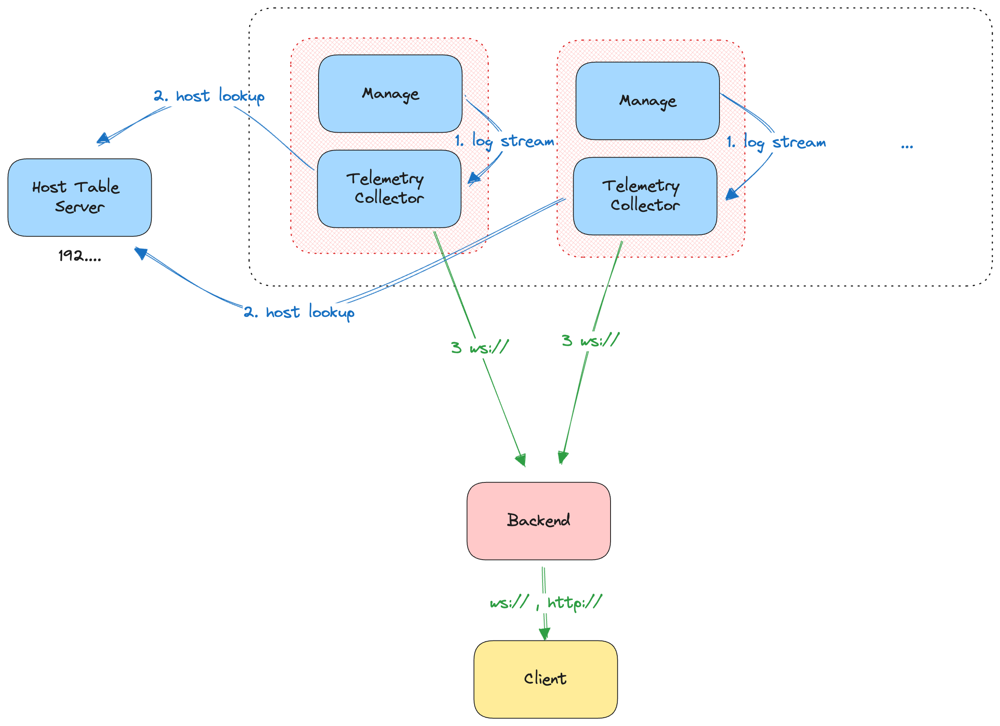

**Alpha Stage**

# Description 


A tool for collecting multiple distributed MAS Manage instance logs into a single view.

# Architecture




# node/ Information

TODO update this further.

1. make sure to change any appropriate .env values to match the OC4 cluster destination.
2. build ``` docker build . ```
3. push the image to a client's OpenShift repo.
4. update the k8s configs in the ``` ./kubernetes ``` folder.
5. push those configs to the OC4 cluster.


